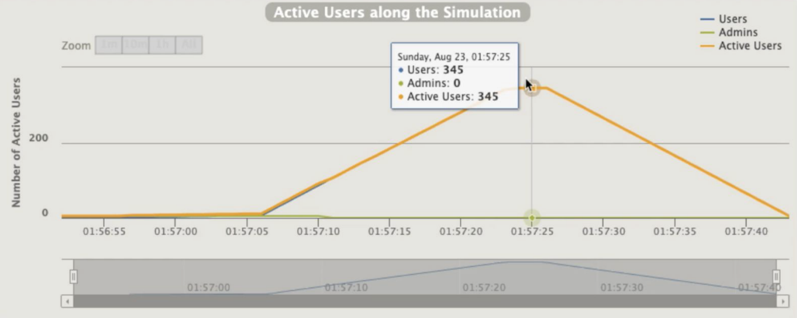
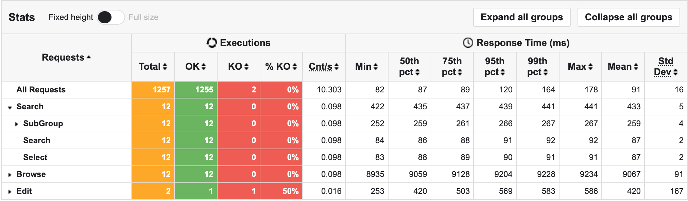
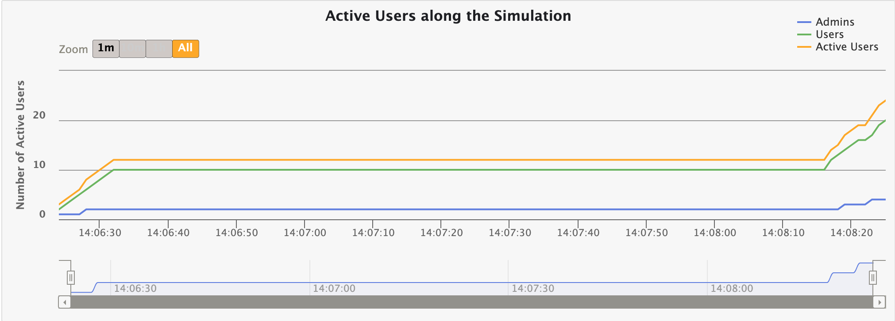
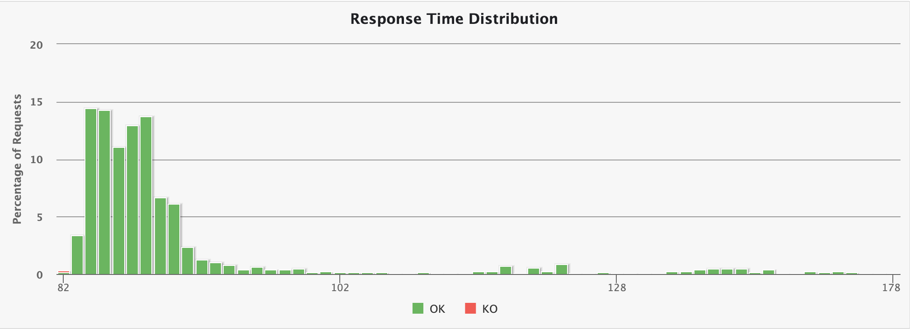
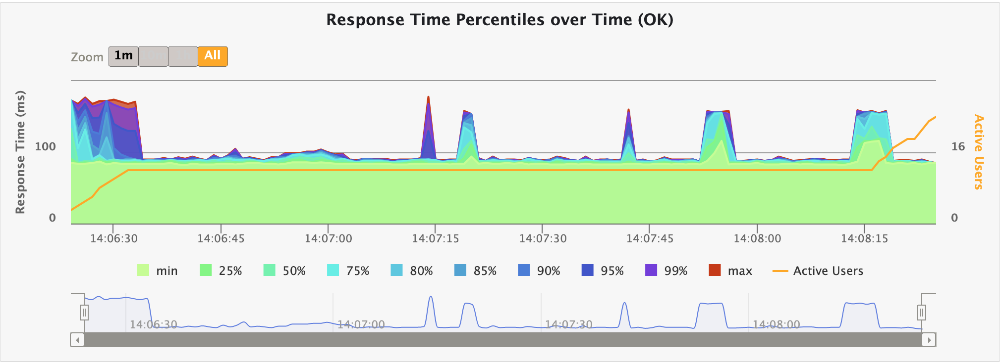
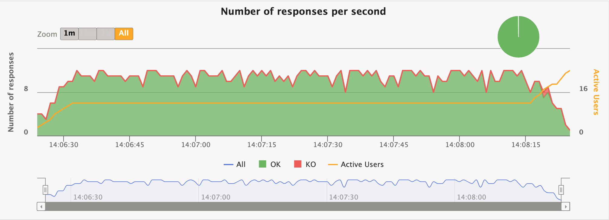

**Gatling 학습 목차**

```
1. 개요 및 설치
2. 스크립트 생성
3. 테스트 시뮬레이션 디자인, 실행 & 리포트 분석
```


# 1. 개요 및 설치

## **목차**

```
1-1. 개요
1-2. 소개
1-3. 전제조건
1-4. Standalone 모드 설치
1-5. Gradle로 설치
```


## 1-1. 개요

- 간략하게 Gatling이 어떻게 동작하고, 강력한 스트레스, 퍼포먼스 테스트를 수행하는 툴인지 알아봅니다.
- Gatling 스크립트 개발 환경을 위해 적절한 전제조건을 알아봅니다.
- Gatling 설치 방식을 알아봅니다. (Standalone 또는 Build tool)


## 1-2. 소개

1. 2012년 소개된 오픈소스 부하, 성능 테스트 프레임워크입니다. 
2. 코드 기반으로 부하테스트를 할 수 있습니다. 즉 버전 컨트롤이 가능합니다.
3. Pure Scala로 작성되었으며 AKKA와 Netty 프레임워크 기반으로 만들어졌습니다.


***JMeter의 Per Thread 모델***

전통적인 JVM 기반 테스팅 툴인 JMeter는 하나의 유저당 하나의 스레드에서 테스트를 진행하여 성능상 한계가 있었습니다.


***Gatling의 메시지 드리븐 아키텍처***

반면에 Gatling은 메시지 드리븐 아키텍처를 통해 더 많은 가상 유저, 메시지를 한 스레드에서 다룰 수 있습니다.

4. Gatling은 Scala, Java, Kotlin으로 스크립트를 작성할 수 있지만 문법을 잘 알지 못해도 사용할 수 있는 DSL을 제공합니다. 즉 읽기 쉬운 스크립트를 제공합니다.

5. 스크립트를 직접 작성하지 않아도 사용자의 동작을 캡쳐하여 스크립트를 생성하는 레코딩 기능을 제공합니다.


***Gatling Recorder***


## 1-3. 전제조건

Gatling 3.7 기준

- Java, Kotlin, Scala로 테스트 스크립트 작성이 가능합니다. 이전 버전은 Scala로만 작성할 수 있습니다.
- JDK 8, 11, 17에 대해서만 지원합니다.


## 1-4. Standalone 모드 설치


***Standalone 모드 번들 설치***

[링크](https://gatling.io/open-source/)에서 Download Now 버튼을 통해 설치합니다.


***번들 폴더 구조***

설치 후 압축을 풀고 들어가면 다음과 같은 형태의 폴더구조가 나옵니다.


***부하테스트 시작***

`bin/gatling.sh` 를 실행하면 어떤 환경에서 테스트를 돌릴지와 `user-files/simulations` 아래의 테스트 스크립트 중 어떤 스크립트를 실행할지 여부를 클릭하여 시작할 수 있습니다.


***부하 테스트 결과***

각 테스트 결과를 보여줍니다.


[](https://kakao.agit.in/secure_link?sub=group&key=300069077&h=wL%2BT4tJTqV8gPYPjWIJ%2F%2FTJNO7U%3D&act=view&ih=164&iw=1356&ref=306607067&wmk=ZXZhbi5uYXZl&wsc=0.5&url=https%3A%2F%2Fmud-kage.kakao.com%2Fwmk%2FWyvN2%2FbtrIfRUi7eO%2Fpd65i8ro70uo38y14yj6xz%2F1200_1200.jpg)

***파일로 떨어지는 결과***

커맨드에서 결과를 확인할수도 있지만, 결과로 나오는 파일을 통해 좀 더 자세한 수치를 확인할 수 있습니다.


[](https://kakao.agit.in/secure_link?sub=group&key=300069077&h=vYa7N99O4KIXBCOnTPMzwvnQh6I%3D&act=view&ih=2296&iw=4024&ref=306607070&wmk=ZXZhbi5uYXZl&wsc=5.0&url=https%3A%2F%2Fmud-kage.kakao.com%2Fwmk%2Ftt6bW%2FbtrIdaABbMo%2Fg8o07rumfcofe6njw0cixz%2F1200_1200.jpg)

***부하테스트 결과***


## 1-5. Gradle로 설치

Gradle Plugin으로 구성된 [예제](https://github.com/gatling/gatling-gradle-plugin-demo)를 받아서 커스터마이징 가능합니다. [Maven](https://github.com/gatling/gatling-maven-plugin), [SBT](https://github.com/gatling/gatling-sbt-plugin)도 각각 예시가 제공되고 있습니다.


# 2. 스크립트 생성

## **목차**

```
2-1. 개요
2-2. 예시 애플리케이션
2-3. Gatling 레코더
2-4. Gatling 스크립트 톺아보기
2-5. 입력 파라미터화
```


## 2-1. 개요

Gatling 스크립트 생성에 대해 다뤄봅니다.

- 테스트할 예시 애플리케이션 둘러보기
- Gatling 레코더에 대해서 알아본다.
- 레코더로부터 만들어진 Gatling 스크립트 톺아보기
- `feeder` 와 `correlation` 으로 스크립트 발전시키기


## 2-2. 예시 애플리케이션


***컴퓨터 데이터베이스 애플리케이션***

Gatling에서 제공하는 [예시 애플리케이션](https://computer-database.gatling.io/computers)은 컴퓨터 데이터베이스 관리 툴입니다. 

- 컴퓨터를 필터링할 수 있다. (검색)

- 새로운 컴퓨터를 추가할 수 있다.

- 컴퓨터 정보를 조회 또는 수정할 수 있다.

- 페이지 기반으로 리스트를 탐색할 수 있다.


## 2-3 Gatling 레코더


***Gatling 레코더***

Gatling은 `Http Proxy`나 `HAR converter` 방식으로 행동 기반 스크립트를 추출할 수 있습니다. 자세한 방법은 [문서](https://gatling.io/docs/gatling/reference/current/http/recorder/)를 확인해주세요. 

예제로는 다음의 시나리오를 레코딩합니다.

> 1. 홈 화면 조회
> 2. 맥북 검색
> 3. 6번 아이디 컴퓨터 조회
> 4. 홈 조회
> 5. 페이지 1~4까지 조회
> 6. 새로운 컴퓨터 생성 페이지 조회
> 7. 새로운 컴퓨터 생성
>
> 자 이제 Gatling 레코더로부터 캡쳐된 스크립트를 봅시다.


## 2-4 Gatling 스크립트 톺아보기


***레코딩 된 스크립트***

Gatling의 모든 스크립트는 기본적으로 세부분으로 구성됩니다:

1. 프로토콜 설정
   - 기본 URL을 설정하고 원하는 프로토콜을 설정합니다.
2. 시나리오 정의
   - 시나리오는 각 가상 사용자가 수행하는 실제 단계를 구성합니다. 모든 트랜잭션은 이전에 레코드로 기록한 대로입니다.

3. 부하 시뮬레이션 디자인
   - 실행할 사용자 수와 속도를 결정합니다.


해당 코드는 충분히 동작하지만 약간의 냄새가 나죠. 하나씩 고쳐보도록 하겠습니다.


### 시나리오 정의 오브젝트화


***오브젝트화 된 시나리오***

> 1, 9, 21: 각 시나리오는 [ChainBuilder](https://gatling.io/docs/gatling/reference/current/core/scenario/) 객체로 나눌 수 있습니다.


### 트랜잭션 이름 읽기 쉽게하기


***읽기 쉬워진 시나리오***

> 2: 레코딩 된 시나리오의 트랜잭션은 `request_n` 형식으로 어떤 작업인지 알기 어렵습니다. 이름을 설정해줍니다.
>
> 10: [반복문](https://gatling.io/docs/gatling/reference/current/core/scenario/#loop-statements)을 이용해 중복 코드를 제거합니다.


### 오브젝트화된 시나리오 재활용


***재활용 가능한 오브젝트***

> 1, 2: 오브젝트화 된 시나리오는 재활용이 가능합니다. 유저는 `search`와 `browse` 작업만을 테스트하고, 어드민은 `search`, `browse`, `create`까지 테스트합니다.


## 2-5. 입력 파라미터화


***입력이 파라미터화 된 search 시나리오***

> 
> ***feeader로 넘긴 search.csv***
>
> 1: [Feeder](https://gatling.io/docs/gatling/reference/current/core/session/feeder/)를 사용하여 CSV 같은 외부 파일로부터 입력을 주입 받습니다. 뒤의 `random`은 입력을 주입하는 방식이며 `queue, random, shuffle, circular` 타입이 있습니다.
>
> 5: `feed()` 메소드에 1에서 주입받은 `feeder`를 넘깁니다.
>
> 6: `search.csv`의 searchCriterion 값을 주입합니다. 
>
> 7: [Checks](https://gatling.io/docs/gatling/reference/current/core/check/)를 이용해 값 검사를 합니다. 다양한 검사를 할 수 있고 현재 예제에서는 css 검증을합니다. `href.a` 태그가 searchComputerName을 가지고 있는지 여부를 검사한 후 맞다면 computerUrl로 해당 url을 저장합니다.
>
> 11: 위에서 저장한 `computerUrl`을 통해 검색을 진행합니다.


# 3. 테스트 시뮬레이션 디자인, 실행 & 리포트 분석

## 목차 

```
3-1. 개요
3-2. Gatling 워크로드 모델
3-3. 시뮬레이션 디자인
3-4. 스크립트 실행 방법
3-5. 레포트 분석
```

## 3-1. 개요

- Open vs Closed 모델
- Gatling 스크립트에 시뮬레이션 추가
- Standalone 또는 빌드 툴로 실행하기
- 테스트 결과 Report 분석


## 3-2. Gatling 워크로드 모델

부하 테스트의 성공을 위한 기반으로는 정확한 사용자 워크로드 시나리오를 만드는 것입니다. 이를 위해 Gatling은 Open, Closed 워크로드 모델을 모두 지원하고 있습니다. 만약 Open 모델임에도 불구하고 Closed 모델모델로 로드테스트를 진행한다면 테스트는 상상했던것과 다른 결과를 내놓을것입니다.

 

[**Open 모델**](https://gatling.io/docs/gatling/reference/current/core/injection/#open-model)

동시 사용자 수를 제어할 수 없습니다. 서비스를 제공하는 데 문제가 있어도 사용자의 연결을 계속 받습니다. 대부분의 웹 사이트는 Open 모델을 사용합니다.

```java
setUp(
  scn.injectOpen(
    nothingFor(4), // 1
    atOnceUsers(10), // 2
    rampUsers(10).during(5), // 3
    constantUsersPerSec(20).during(15), // 4
    constantUsersPerSec(20).during(15).randomized(), // 5
    rampUsersPerSec(10).to(20).during(10), // 6
    rampUsersPerSec(10).to(20).during(10).randomized(), // 7
    stressPeakUsers(1000).during(20) // 8
  ).protocols(httpProtocol)
);
```

***Open 모델의 DSL 메소드 예***

1) 지정된 시간 동안 일시 중지합니다.
2) 주어진 수의 사용자를 한 번에 주입합니다.
3) 주어진 기간 동안 균등하게 분포된 주어진 수의 사용자를 주입합니다. (5초동안 일정하게 2명씩 투입)
4) 지정된 기간 동안 초당 사용자 수로 정의된 일정한 속도로 사용자를 주입합니다. 사용자는 일정한 간격으로 주입됩니다. (15초동안 1초당 20명 투입)
5) 위와 동일하지만 그 비율을 랜덤화한다.
6) 지정된 기간 동안 초당 사용자 수로 정의된 시작 속도에서 목표 속도까지 사용자를 주입합니다. 사용자는 일정한 간격으로 주입됩니다. (10초 동안 1초당 10명을 시작으로 주입하되, 그 비율을 1초당 20명까지 늘린다.) 
7) 위와 동일하지만 그 비율을 랜덤화한다.
8) 주어진 기간으로 늘어난 [헤비사이드 스텝 함수](http://en.wikipedia.org/wiki/Heaviside_step_function)에 따라 주어진 수의 사용자를 주입합니다 .

 

[**Closed 모델**](https://gatling.io/docs/gatling/reference/current/core/injection/#closed-model)

동시 사용자 수가 제한되는 시스템입니다. 큐가 전부 차면, 다른 사용자가 종료 해야지 새로운 사용자가 들어 올 수 있습니다. 게임 또는 티켓팅 웹사이트가 이 모델의 예입니다.

```java
setUp(
  scn.injectClosed(
    constantConcurrentUsers(10).during(10), // 1
    rampConcurrentUsers(10).to(20).during(10) // 2
  )
);
```

***Closed 모델의 DSL 메소드 예***

1) 동시 사용자 수가 일정하도록 주입
2) 시스템의 동시 사용자 수가 선형적으로 증가하도록 주입


두 모델의 더 자세한 차이점은 Gatling 블로그의 [포스트1](https://gatling.io/2018/10/gatling-3-closed-workload-model-support/), [포스트2](https://gatling.io/2020/04/how-easily-can-i-perform-a-load-test/)에서 확인 가능합니다.


## 3-3. 시뮬레이션 디자인

Gatling은 `setUp()` 블록에서 시뮬레이션을 디자인합니다. 일반적으로 맨 아래둡니다. 

```java
setUp(users.injectOpen(
  nothingFor(5),
  atOnceUsers(1),
  rampUsers(5).during(10),
  constantUsersPerSec(20).during(20))
).protocols(httpProtocol);
```

***시뮬레이션 예***

위 시나리오는 다음과 같은 레포트를 기대할 수 있습니다.



***시뮬레이션 레포트***


## 3-4. 스크립트 실행

### Standalone

`1. 개요 및 설치`에서 이미 다뤘습니다.


### 빌드 툴

- Maven [문서](https://gatling.io/docs/gatling/reference/current/extensions/maven_plugin/)
- Gradle [문서](https://gatling.io/docs/gatling/reference/current/extensions/gradle_plugin/)
- SBT [문서](https://gatling.io/docs/gatling/reference/current/extensions/sbt_plugin/)


## 3-5.  [레포트](https://gatling.io/docs/gatling/reference/current/stats/reports/) 분석

레포트는 다양한 지표를 보여줍니다.


### 응답 시간 표시

[](https://gatling.io/docs/gatling/reference/current/stats/reports/images/charts-indicators.png)

***Response Time Range 차트***

이 차트는 응답 시간이 표준 범위에 어떻게 분포되어 있는지 보여줍니다. 오른쪽 패널에는 OK/KO 요청 수가 표시됩니다. (이 범위는 `gatling.conf`파일에서 구성할 수 있습니다.)


[](https://gatling.io/docs/gatling/reference/current/stats/reports/images/charts-statistics.png)

그 아래 패널에선 최소, 최대, 평균, 표준 편차 및 백분위수와 같은 일부 표준 통계가 요청별로 표시합니다. (이러한 백분위수는 `gatling.conf`파일에서 구성할 수 있습니다.)

시나리오에 그룹이 포함된 경우 이 패널은 트리가 됩니다. 각 그룹은 리프가 아닌 노드이고 각 요청은 그룹의 하위 리프입니다. 그룹 경과 시간은 그룹 내 모든 요소의 누적 응답 시간입니다. 


### 시간 경과에 따른 Active 사용자 

[](https://gatling.io/docs/gatling/reference/current/stats/reports/images/charts-users.png)

이 차트는 시뮬레이션 중 Active 사용자(총 및 시나리오당)를 표시합니다.

`Active 사용자`는 `concurrent 사용자` 또는 `사용자 도착율`이 아닙니다. 이는 Open 및 Closed 워크로드 모델 모두에 사용되며 `주어진 시간에 부하가 걸린 시스템에서 활성 상태였던 사용자`를 나타내는 일종의 혼합 메트릭입니다. 

```
  (number of alive users at previous second)
+ (number of users that were started during this second)
- (number of users that were terminated during previous second)
```

[***계산 방식***](https://gatling.io/docs/gatling/reference/current/stats/timings/)


### 응답 시간 분포 

[](https://gatling.io/docs/gatling/reference/current/stats/reports/images/charts-distrib.png)

이 차트는 응답 시간의 분포를 표시합니다.


### 시간 경과에 따른 응답 시간 백분위수 

[](https://gatling.io/docs/gatling/reference/current/stats/reports/images/charts-response-percentiles-per-sec.png)

이 차트는 시간 경과에 따른 다양한 응답 시간 백분위수를 표시하지만 성공한 요청에 대해서만 해당됩니다. 실패한 요청은 조기에 종료되거나 시간 초과로 인해 발생할 수 있으므로 백분위수 계산에 큰 영향을 미칩니다.


### 시간 경과에 따른 초당 요청 수

[](https://gatling.io/docs/gatling/reference/current/stats/reports/images/charts-requests-per-sec.png)

이 차트는 시간 경과에 따른 초당 전송된 요청 수를 표시합니다.


###  시간 경과에 따른 초당 응답 수



이 차트는 시간 경과에 따른 초당 수신 응답 수(총, 성공 및 실패)를 표시합니다.


### 글로벌 RPS에 대한 응답 시간 

[](https://gatling.io/docs/gatling/reference/current/stats/reports/images/charts-response-time-global-rps.png)

이 차트는 동시에 전체 요청 수에 따라 주어진 요청에 대한 응답 시간이 어떻게 분포되는지 보여줍니다.

