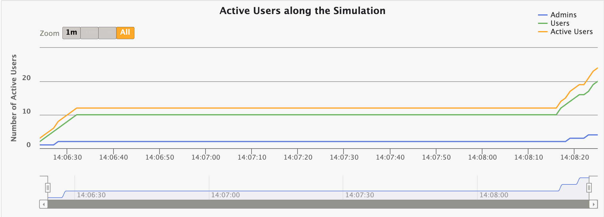
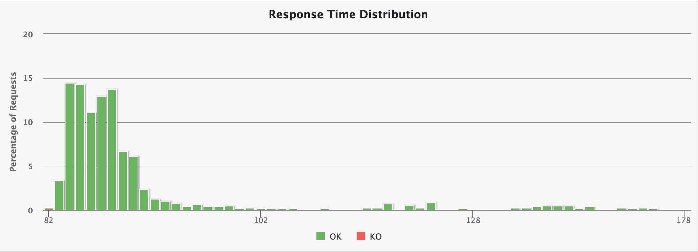

### [Gatling](https://github.com/gatling/gatling)


Gatling은 고성능 부하 테스트 도구입니다. 사용 용이성, 유지 보수 용이성 및 고성능을 위해 설계되었습니다.

Gatling은 기본적으로 HTTP 프로토콜을 훌륭하게 지원하므로 모든 HTTP 서버를 부하 테스트하기 위한 도구로 선택할 수 있습니다. 코어 엔진은 실제로 프로토콜에 구애받지 않기 때문에 다른 프로토콜에 대한 지원을 구현하는 것이 완벽하게 가능합니다.

[빠른 시작](https://gatling.io/docs/gatling/tutorials/quickstart/) 에는 HTTP 서버 부하 테스트를 위한 간단한 시나리오 설정을 안내하는 가장 중요한 개념에 대한 개요가 있습니다.

코드로 정의되고 리소스 효율적인 *시나리오* 를 갖는 것은 우리가 Gatling을 만들도록 동기를 부여한 두 가지 요구 사항입니다. [표현이 풍부한 DSL](http://en.wikipedia.org/wiki/Domain-specific_language) 을 기반으로 하는 시나리오 *는* 자명합니다. 유지 관리가 쉽고 버전 관리 시스템에 보관할 수 있습니다.

Gatling의 아키텍처는 HTTP와 같은 기본 프로토콜이 비차단 방식으로 구현될 수 있는 한 비동기식입니다. 이러한 종류의 아키텍처를 통해 가상 사용자를 전용 스레드 대신 메시지로 구현하여 리소스를 매우 저렴하게 만들 수 있습니다. 따라서 수천 명의 동시 가상 사용자를 실행하는 것은 문제가 되지 않습니다.


### 장점

- **SSE 프로토콜을 라이브러리 단에서 지원하고 있습니다.**
- 다양한 지표를 제공하는 UI를 지원합니다.
- 커맨드라인으로 실행이 가능합니다.
- 부하테스트를 코드로 작성합니다. 
- 멀티스레드로 가상 유저를 동작시키는 것이 아닌 비동기식으로 분산된 액터 모델을 기반으로하는  Akka 툴킷을 사용하므로 다른 프레임워크(예: JMeter)보다 빠릅니다.


### 특징

- 기본 HTTP 요청, 응답 프로토콜 외에도 다양한 프로토콜을 지원합니다.

- Scala, Java 또는 Kotlin으로 시나리오 작성이 가능합니다. 동시에 모든 사람이 시나리오를 읽을 수 있도록 DSL(Domain Specific Language)를 제공합니다.

  ```java
  class BasicSimulationJava extends Simulation {
  
    HttpProtocolBuilder httpProtocol = http
      .baseUrl("http://computer-database.gatling.io")
      .doNotTrackHeader("1")
      .acceptLanguageHeader("en-US,en;q=0.5")
      .acceptEncodingHeader("gzip, deflate")
      .userAgentHeader("Mozilla/5.0 (Windows NT 5.1; rv:31.0) Gecko/20100101 Firefox/31.0");
  
    ScenarioBuilder scn = scenario("BasicSimulation")
      .exec(http("request_1")
        .get("/"))
      .pause(5);
    
    setUp(
      scn.injectOpen(atOnceUsers(1))
    ).protocols(httpProtocol);
  }
  ```

- Bundle을 통한 커맨드라인이나 Gradle, Maven 등의 빌드 툴을 이용해 실행할 수 있습니다.

- Gatling Report는 여러가지 정보를 제공합니다.

  

  ***응답 시간 분포***
  ***최소, 최대, 평균, 표준편차, 백분위 등의 스탯***

  
  ***시뮬레이션 중 Active 사용자 수***

  
  ***응답시간 분포도***
  
  ***요청 응답 시간 차트***

  
  ***RPS 수치***

- 지속적인 부하 테스트를 위해 설계 되었으며 개발 파이프라인과 통합할 수 있습니다.

  

- Grafana나 Taurus와 같은 모니터링 툴과 통합할 수 있습니다.

- HTTP 요청 응답으로부터 시나리오를 만들어주는 웹 레코더가 지원 됩니다. 