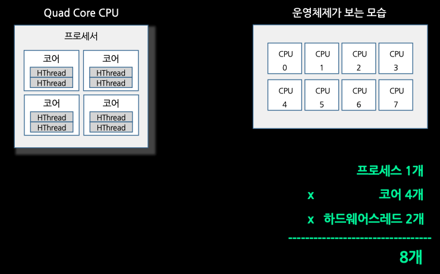
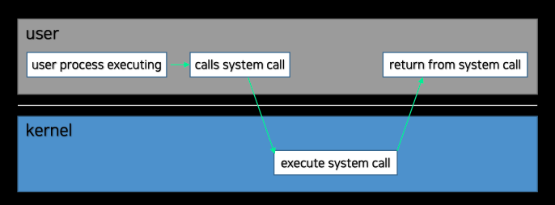
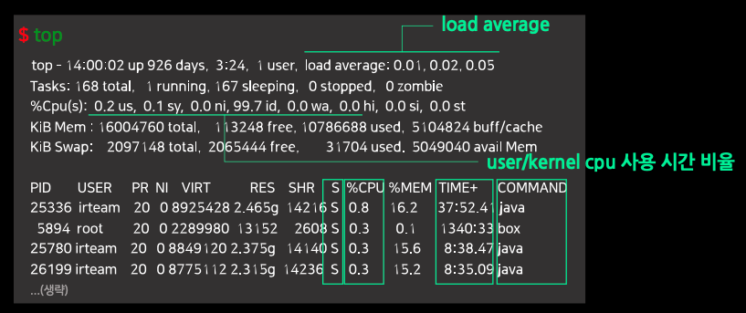
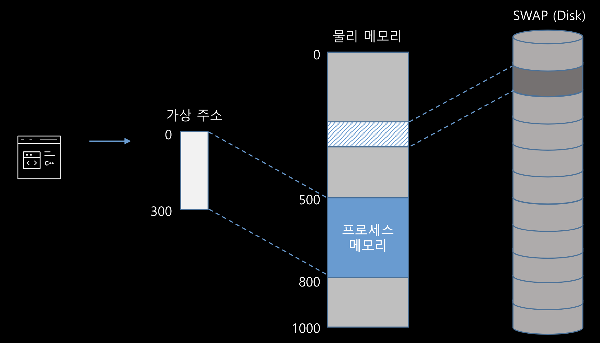
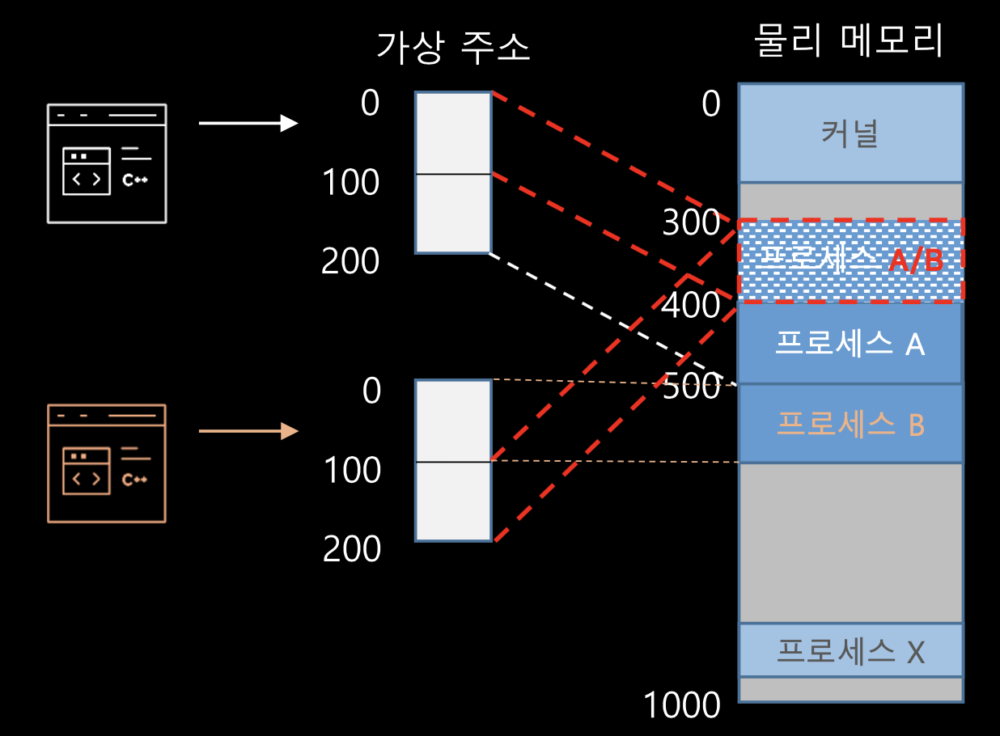
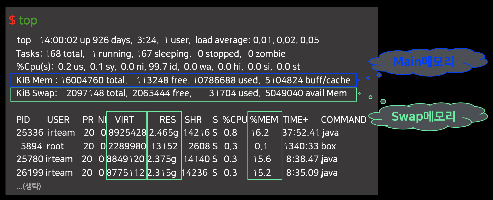

# 서버 자원 사용률 점검 항목

시스템 성능에 문제가 생기면 장애로 연결된다. 일반 사용자 입장에서 화면 접근이 안되거나 느리거나 특정 기능이 동작하지 않게 된다. 이런 문제를 예방하고 해결하기 위해서는 서버 자원 사용률에 대한
점검이 필요하다.

- CPU
    - CPU 자원이 부족한가?
    - CPU 사용 유형 중 System 이나 I/O Wait의 사용률이 높은가?
    - 프로세스별 CPU 사용률 분포는 균등한가?
- 메모리
    - 메모리 자원이 부족한가?
    - 서버 전체 또는 개별 프로세스 단위로 메모리 사용량이 지속적으로 증가하는가?
- 디스크
    - 디스크 서비스 시간은 디스크 대기시간을 포함해서 얼마인가?
    - 파일시스템 중 공간이 부족한 곳은 있는가?
- 네트워크
    - 네트워크 데이터 전송량은 얼마인가?
    - 네트워크 재전송량이 많은가?
    - RTT(Rount-Trip Time) 시간은 높은가?

- Linux 시스템 모니터링 도구들
    - top: 시스템 전체 각 프로세스 별로 CPU, 메모리 사용량 등을 확인할 수 있다.
    - ps: 프로세스 정보를 리포팅해준다.
    - vmstat: 전체 메모리, 사용자별 메모리 등... virtual 메모리 사용량을 확인할 수 있다.
    - sar: CPU, 메모리 사용량의 실시간 통계 정보를 확인할 수 있다.
    - iostat: 디스크 장치로의 요청량에 대한 통계 정보를 확인할 수 있다. er
    - pidstat: 특정 프로세스에 대한 CPU, 메모리, I/O 통계 정보를 확인할 수 있다.

## CPU

- CPU 사용률 : (Kernel idle thread를 제외한) 다음 thread 들에 의해 사용된 시간의 백분율(%)
    - user-level application thread
    - kernel thread
    - interrupt 처리
- Load average : CPU에 처리 요청된 작업들 중 실행중인 것과 대기중인 것을 수치화 한 것
    - 논리적 CPU: 운영체제가 인지하는 CPU
    - 
    - 논리적 CPU 마다 실행하기 위해 대기하는 Run Queue를 갖고 있다.
- User-Time / Kernel-Time
    - 
    - User-Time
        - user-level application 코드를 실행하는데 소비한 시간
    - Kernel-Time
        - kernel-level 코드를 실행하는데 소비한 시간
        - system call 처리
        - interrupt 처리
        - I/O 처리(대기)
- Elapsed Time / (CPU) Time
    - Elapsed Time: 프로세스가 시작해서 종료할 때 까지의 경과 시간
    - (CPU) Time: 프로세스가 실제로 논리 CPU를 사용한 시간
    - 터미널에서 ```time sleep 5```을 실행해보자.

### 모니터링 도구

#### uptime

```shell
❯ uptime
22:29  up 48 days,  4:19, 2 users, load averages: 2.94 3.71 4.13
```

- 시스템 실행중인 시간 확인
- Load Average: 특정 시간 단위의 Load 평균 값
    - 첫번째 값: 최근 1분 동안 load avg
    - 두번째 값: 최근 5분 동안 load avg
    - 세번째 값: 최근 15분 동안 load avg

시간 단위의 Load 평균 값들을 통해서 Load의 추이를 알 수 있다. (Load가 증가하는지 감소하는지)
Load의 값은 논리적인 CPU 수에 따라서(상황에 따라) 부하의 정도가 다르다.  
ex) 8.00 이라는 Load 값은 논리적인 CPU 수가 4개인 상황이라면 부하가 200% 이지만, 논리적인 CPU 수가 16개인 상황이라면 부하가 50%인 것이다.

#### vmstat

cpu 사용량 통계 정보를 확인할 수 있다.

```shell
❯ docker run -it ubuntu

root@b9ef86c52f9b:/# vmstat
procs -----------memory---------- ---swap-- -----io---- -system-- ------cpu-----
 r  b   swpd   free   buff  cache   si   so    bi    bo   in   cs us sy id wa st
 2  0  69716 1376708 240924 1833804    0    2    55   325  751 1144  5  2 93  0  0

root@b9ef86c52f9b:/# vmstat 5
procs -----------memory---------- ---swap-- -----io---- -system-- ------cpu-----
 r  b   swpd   free   buff  cache   si   so    bi    bo   in   cs us sy id wa st
 2  0  69716 1382064 240928 1833948    0    2    55   324  750 1143  5  2 93  0  0
 1  0  69716 1383048 240932 1834004    0    0     0   169 4919 8233  1  1 98  0  0
 1  0  69716 1382048 240936 1834004    0    0     0    61 3394 5745  1  1 99  0  0
```

- r: 실행중 또는 Run Queue에 대기 중인 task 수
- b: uninterruptible sleep task 수 (I/O 작업 이후 대기하거나, Lock이 풀리기를 대기하는 수)
- us: user-time (%)
- sy: kernel-time (%)
- id: idle time (%)
- wa: I/O 대기 시간 (%) (ex. Disk 읽기 기다림)

#### ps

프로세스 상태(Process Status)를 확인할 수 있다.

```shell
root@b9ef86c52f9b:/# ps aux
USER       PID %CPU %MEM    VSZ   RSS TTY      STAT START   TIME COMMAND
root         1  0.0  0.0   4116  3472 pts/0    Ss   13:39   0:00 bash
root        13  0.0  0.0   5904  2884 pts/0    R+   13:46   0:00 ps aux
```

- User: 프로세스 소유자
- PID: 정수 형태의 프로세스 고유 식별자
- $CPU: CPU 사용률
- TIME: 해당 프로세스 생성 이후부터 소비한 전체 CPU 시간(user + system)

다음과 같이 특정 값만 조회하는 것도 가능하다.

```shell
root@b9ef86c52f9b:/# ps -eo pid,comm,time,etime
  PID COMMAND             TIME     ELAPSED
    1 bash            00:00:00       11:15
   19 ps              00:00:00       00:00
```

#### top



- USER: 프로세스 소유자
- PID: 정수 형태의 프로세스 고유 식별자
- $CPU: CPU 사용률
- TIME+: CPU 사용 시간
- COMMAND: 명령어

#### jstack, pstack, TDA(Thread Dump Analyzer)

시스템의 부하가 높은 시점에 실행중인 프로세스의 stack trace를 확인했을 때 특정 부분이 많이 보인다면 그 부분을 병목지점으로 생각할 수 있다.

stack trace 혹은 thread dump는 짧은 시간(5~10초 주기로) 최소 2회~3회 이상 생성해서 비교하며 확인하는 것을 권장한다.

## 메모리

### Virtual Memory



- 각 프로세스별로 큰 선형 메모리 공간을 제공
- 물리 메모리 위치는 OS에 의해 관리
- 물리 메모리보다 큰 가상 메모리 공간 제공 가능 (디스크를 이용한 SWAP을 이용. 그러나 성능 저하가 있다.)
- 특정 Page를 다른 프로세스들 간에 매핑(Shared Memory)

메모리 사용량 관련해서 확인할 수 있는 지표 2가지.

- Virtual Memory Size (VSZ)
    - 프로세스가 접근할 수 있는 가상 메모리의 크기
    - **공유 라이브러리의 영역 미포함**
- Resident Set Size (RSS)
    - 메인 메모리에 할당된 메모리 크기
    - **공유 라이브러리의 영역 포함**
        - 
    - SWAP 미 포함

### 모니터링 도구

#### vmstat

가상메모리 통계 정보를 확인할 수 있다.

```shell
❯ docker run -it ubuntu

root@b9ef86c52f9b:/# vmstat
procs -----------memory---------- ---swap-- -----io---- -system-- ------cpu-----
 r  b   swpd   free   buff  cache   si   so    bi    bo   in   cs us sy id wa st
 2  0  69716 1376708 240924 1833804    0    2    55   325  751 1144  5  2 93  0  0

root@b9ef86c52f9b:/# vmstat 5
procs -----------memory---------- ---swap-- -----io---- -system-- ------cpu-----
 r  b   swpd   free   buff  cache   si   so    bi    bo   in   cs us sy id wa st
 2  0  69716 1382064 240928 1833948    0    2    55   324  750 1143  5  2 93  0  0
 1  0  69716 1383048 240932 1834004    0    0     0   169 4919 8233  1  1 98  0  0
 1  0  69716 1382048 240936 1834004    0    0     0    61 3394 5745  1  1 99  0  0
```

- free: 사용 가능한 메모리양
- buff: Buffer Cache에 있는 메모리
- cache: Page Cache에 있는 메모리
- si: Page-in 된 메모리
- so: Page-out 된 메모리

> Buffer Cache  
> : Data Buffer로서 block device(예. HDD) driver에 의해 사용, 디스크 장치의 고정된 크기의 block을 캐싱
>
> Page Cache  
> : 디스크상에 저장된 데이터의 접근 속도 향상을 위한 캐시, 파일/디렉토리 I/O 성능 향상, 가능한 많은 메모리 영역을 사용, App에서 사용할 메모리가 부족해지면, kswaped Deamon에 의해 해제(반납)

#### ps

프로세스 상태(Process Status)를 확인할 수 있다.

```shell
root@b9ef86c52f9b:/# ps aux
USER       PID %CPU %MEM    VSZ   RSS TTY      STAT START   TIME COMMAND
root         1  0.0  0.0   4116  3472 pts/0    Ss   13:39   0:00 bash
root        13  0.0  0.0   5904  2884 pts/0    R+   13:46   0:00 ps aux
```

- User: 프로세스 소유자
- PID: 정수 형태의 프로세스 고유 식별자
- %MEM: 메인 메모리 사용량(RSS)의 전체 시스템에 대한 비율
- RSS: 프로세스의 주 메모리 사용 크기
- VSZ: 프로세스의 가상 메모리 사용 크기

#### top



- VIRT: Virtual Memory 영역 크기
- RES: 메인 메모리에서 사용하는 영역 크기(Shared Memory 영역 포함)
- %MEM: 메인 메모리 사용량(RSS)의 전체 시스템에 대한 비율

## 디스크

### 모니터링 도구

#### df

디스크 공간 사용량

```shell
root@b9ef86c52f9b:/# df -h
Filesystem      Size  Used Avail Use% Mounted on
overlay          59G   11G   45G  20% /
tmpfs            64M     0   64M   0% /dev
tmpfs           3.4G     0  3.4G   0% /sys/fs/cgroup
shm              64M     0   64M   0% /dev/shm
/dev/vda1        59G   11G   45G  20% /etc/hosts
tmpfs           3.4G     0  3.4G   0% /proc/acpi
tmpfs           3.4G     0  3.4G   0% /sys/firmware
```

#### du

파일/디렉토리의 디스크 사용량

```shell
root@b9ef86c52f9b:/# du -h --max-depth=1
20K     ./root
4.0K    ./tmp
0       ./sys
du: cannot access './proc/38/task/38/fd/4': No such file or directory
du: cannot access './proc/38/task/38/fdinfo/4': No such file or directory
du: cannot access './proc/38/fd/3': No such file or directory
du: cannot access './proc/38/fdinfo/3': No such file or directory
0       ./proc
4.0K    ./boot
4.0K    ./mnt
73M     ./usr
4.5M    ./var
20K     ./run
4.0K    ./srv
4.0K    ./media
628K    ./etc
4.0K    ./opt
0       ./dev
4.0K    ./home
78M     .
```
